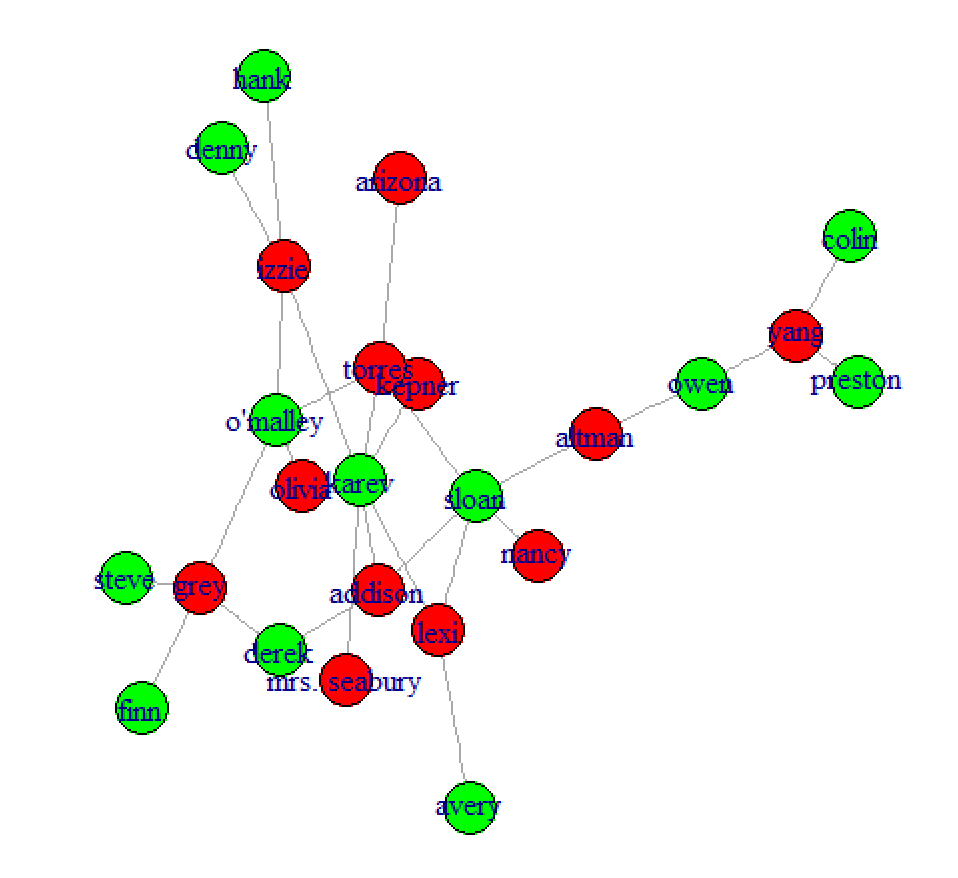
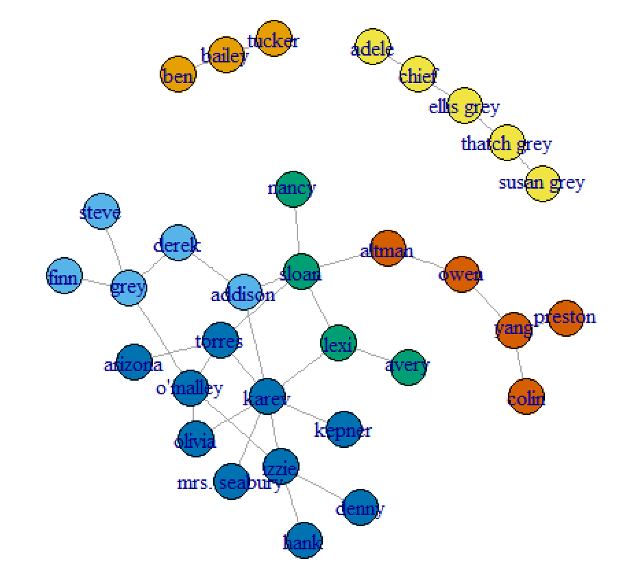
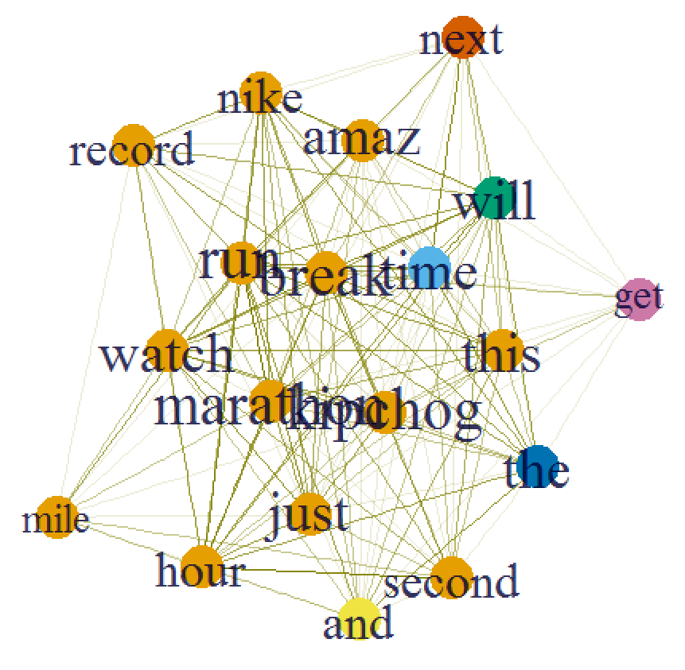
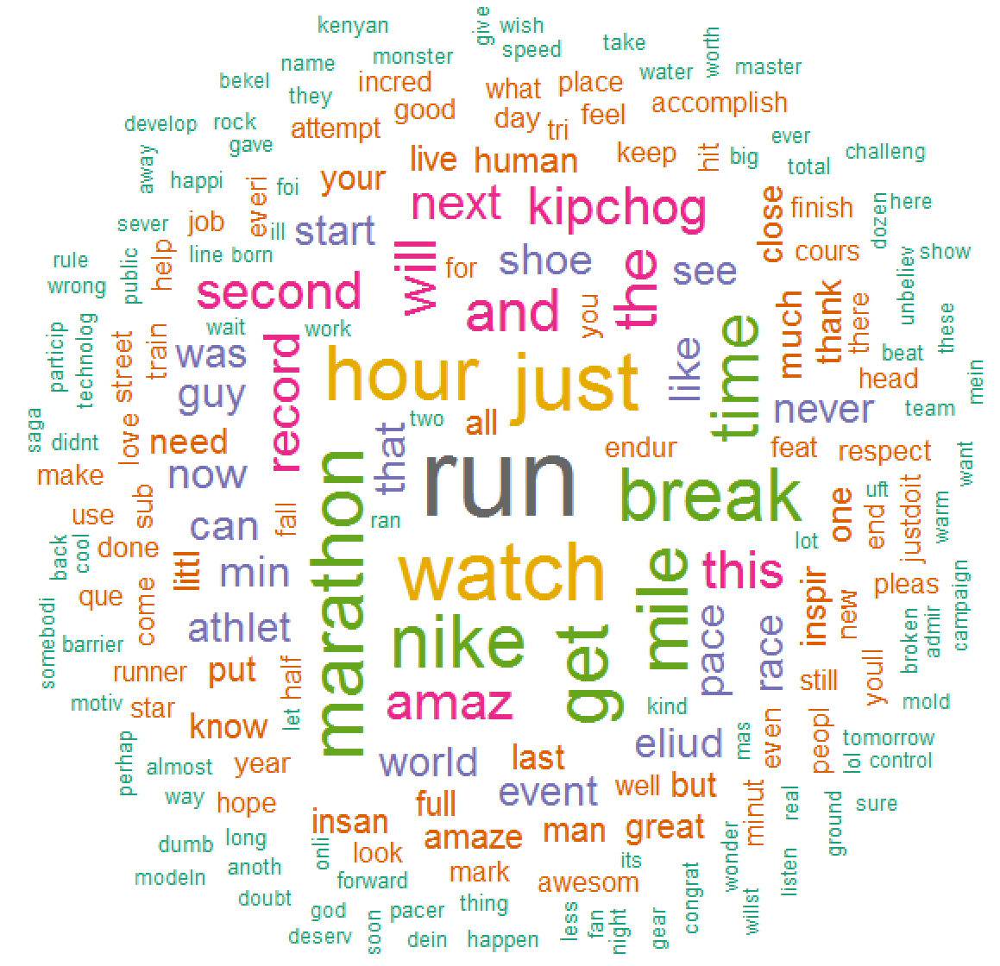
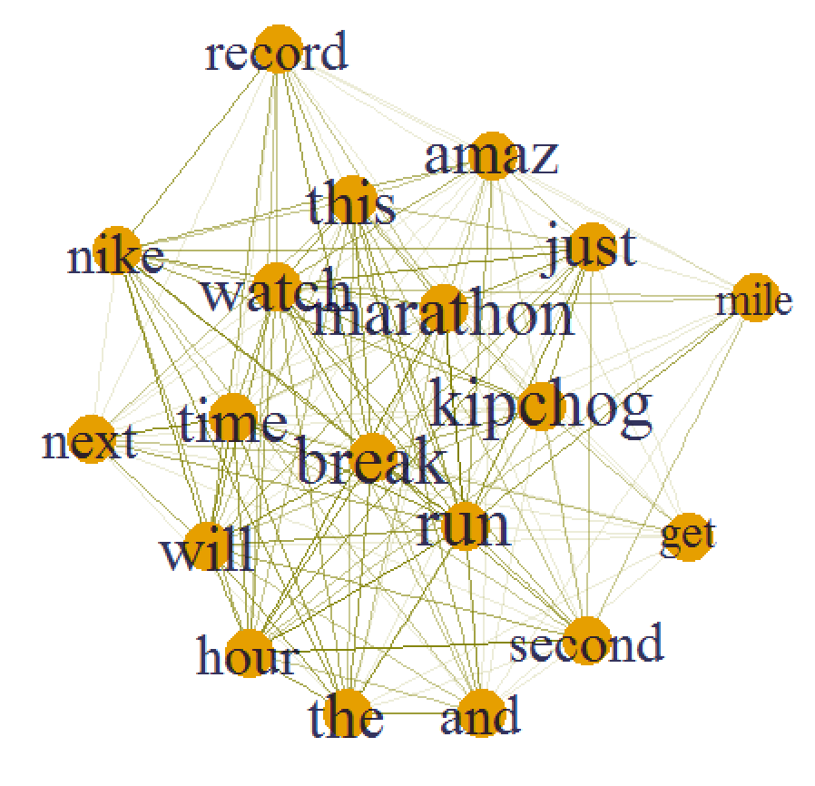
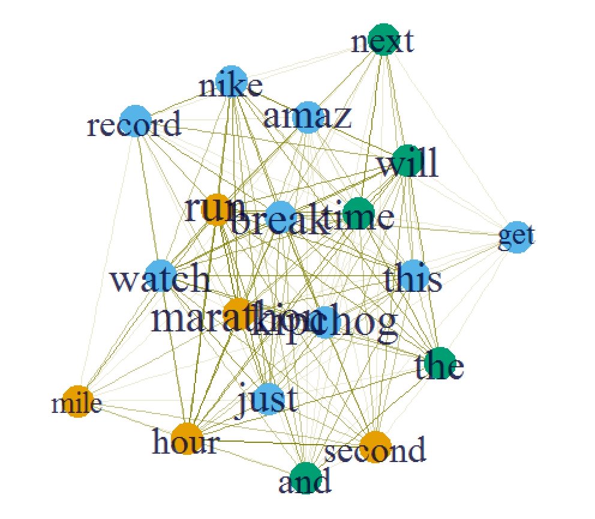
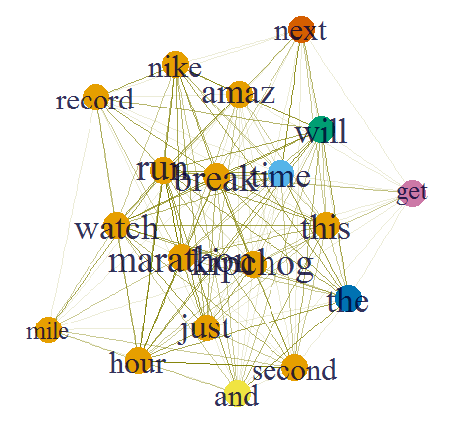

Assignment 3 
================

Gal Bar 200462133, Gal Steimberg 201253572


## Question 1.a

#### Data Preprocessing
We would like to preprocess the data into a graph to better understand it. By picturing the data as a graph we will be able to take the largest connectivity component and answer question 1a accordingly.
The following is the code we used to create the graph seen below it.

``` r
install.packages("igraph")
library(igraph)

#read the given .csv files from the local path
relations <- read.csv(file="C:/src/Academy/ga_edgelist.csv", header=T, sep=",")
actors <- read.csv(file="C:/src/Academy/ga_actors.csv", header=T, sep=",")

#create the graph data frame from the fetched data
graph <- graph.data.frame(relations, directed=FALSE, vertices=actors)

#create a subgraph with the greatest tethering component
gtc <- which.max(components(graph)$csize)
subv <- V(graph)[which(components(graph)$membership==gtc)]
gtc_graph <- induced.subgraph(graph=graph, vids=subv)

#seperate into two groups by gender
women <- which(V(gtc_graph)$gender=="F")
V(gtc_graph)$color <- "green"
V(gtc_graph)$color[women] <- "red"

#print the graph
plot(gtc_graph)
```




As seen in the graph, we extracted the largest component in the graph. Let's calculate the scores for each measure requested.

#### Betweeness
For every pair of vertices in a connected graph, there exists at least one shortest path between the vertices such that either the number of edges that the path passes through (for unweighted graphs) or the sum of the weights of the edges (for weighted graphs) is minimized. The betweenness centrality for each vertex is the number of these shortest paths that pass through the vertex.
``` r
#betweenness
betweenness <- betweenness(gtc_graph, v=V(gtc_graph))
betweenness
```

     addison       altman      arizona        avery        colin        denny 
    44.08333     76.00000      0.00000      0.00000      0.00000      0.00000 
       derek         finn         grey         hank        izzie        karev 
    17.95000      0.00000     46.86667      0.00000     47.95000     95.26667 
      kepner         lexi mrs. seabury        nancy       olivia     o'malley 
     0.00000     36.00000      0.00000      0.00000      4.95000     54.41667 
        owen      preston        sloan        steve       torres         yang 
    60.00000      0.00000    115.36667      0.00000     67.15000     43.00000 

Sloan has the highest betweeness centrality with 115.36667

#### Closeness
The closeness of a node is a measure of centrality in a network, calculated as the sum of the length of the shortest paths between the node and all other nodes in the graph. 
``` r
#closeness
closeness <- closeness(gtc_graph, vids=V(gtc_graph))
closeness
```
     addison       altman      arizona        avery        colin        denny 
     0.016949153  0.013698630  0.012658228  0.011494253  0.007751938  0.010989011 
       derek         finn         grey         hank        izzie        karev 
     0.013698630  0.010101010  0.012987013  0.010989011  0.014492754  0.016949153 
      kepner         lexi mrs. seabury        nancy       olivia     o'malley 
    0.012345679  0.015384615  0.012345679  0.012345679  0.013698630  0.015873016 
        owen      preston        sloan        steve       torres         yang 
    0.011235955  0.007751938  0.016949153  0.010101010  0.017543860  0.009345794 
    
Torress has the highest closeness centrality with 0.017543860


## Question 1.b

### 1 - Louvain Clustering
The Louvain Method for community detection is a method to extract communities from large networks created by Vincent Blondel, Jean-Loup Guillaume, Renaud Lambiotte and Etienne Lefebvre. The method is a greedy optimization method that appears to run in time O(n log n).

``` r
#cluster louvain
set.seed(1)
cl <- cluster_louvain(graph)
cl
```

     IGRAPH clustering multi level, groups: 6, mod: 0.59
     + groups:
       $`1`
       [1] "bailey" "ben"    "tucker"

       $`2`
       [1] "addison" "derek"   "finn"    "grey"    "steve"  

       $`3`
       [1] "avery" "lexi"  "nancy" "sloan"

       $`4`
       + ... omitted several groups/vertices

#### Graph Painting

``` r
plot(graph, vertex.color=membership(cl))
```



#### Number of Communities

We can see from the table provided above that the number of communities = **6**

#### Modularity Score

We can see from the table provided above that the modularity score = **0.59**


### 2 - Edge Betweeness Clustering
The Edge Betweenness algorithm detects communities by progressively removing edges from the original network. The connected components of the remaining network are the communities. Instead of trying to construct a measure that tells us which edges are the most central to communities, the Edge Betweeness algorithm focuses on edges that are most likely "between" communities.

``` r
#cluster edge betweenness
set.seed(1)
ceb <- cluster_edge_betweenness(graph)
ceb
```
     IGRAPH clustering edge betweenness, groups: 7, mod: 0.58
     + groups:
       $`1`
       [1] "addison"      "avery"        "karev"        "kepner"       "lexi"        
       [6] "mrs. seabury" "nancy"        "sloan"       

       $`2`
       [1] "adele"       "chief"       "ellis grey"  "susan grey"  "thatch grey"

       $`3`
       [1] "altman"  "colin"   "owen"    "preston" "yang"   

       + ... omitted several groups/vertices
   
       
#### Graph Painting
``` r
plot(graph, vertex.color=membership(ceb))
```



#### Number of Communities
We can see from the table provided above that the number of communities = **7**

#### Modularity Score
We can see from the table provided above that the modularity score = **0.58**


## Question 2

We will perform social netwrok analysis on "Nike" Facebook feed. We will use the credentials to retrieve these posts and then perform some additional editing and preprocessing on the posts.

#### Configurating credentials and retrieving the data

``` r
app_id <- "219936741834182"
app_secret <- "1e8ad2627d99702754e9487af039a571"
fb_oauth <- fbOAuth(app_id, app_secret)
access_token <- "EAADICANevcYBALERIpywySq2x3YZBNBU9Wr2jR4ZA8Vsh5aQTWtngZAsIZAMi8zFRroGCEVkJBI9ab1ZBpLws3KYrxQhnVZB4DDm6yML9vZCDHAb4HJZACgZAjUca67Jyl3t7klRQfNRUMuYp8oldMeLKzPZAhucyCXscZD"

nike_page <- getPage(page="nike", token=access_token)
nike_post <- getPost(post=nike_page$id[1], n=100, token=access_token)
nike_message <- (nike_post$comments)$message

docs <- Corpus(VectorSource(nike_message))
```
#### Editing and preprocessing

To create the graph we want, we need to preprocess the data that we have and produce a more organized set of data

``` r
#Convert the text to lower case
docs <- tm_map(docs, content_transformer(tolower))

#Remove numbers
docs <- tm_map(docs, removeNumbers)

#Remove english common stopwords
docs <- tm_map(docs, removeWords, stopwords("english"))

#Remove punctuations
docs <- tm_map(docs, removePunctuation)

#Eliminate extra white spaces
docs <- tm_map(docs, stripWhitespace)

#Text stemming
docs <- tm_map(docs, stemDocument)
```

We also used word counting to create a word cloud that would give us a perspective on the number of words in the data:

``` r
#Word counts
tdm <- TermDocumentMatrix(docs)
m <- as.matrix(tdm)
v <- sort(rowSums(m), decreasing=TRUE)
d <- data.frame(word=names(v), freq=v)
head(d, 10)

#Draw word cloud
wordcloud(words=d$word, freq=d$freq, min.freq=1, max.words=200, random.order=FALSE, rot.per=0.35, colors=brewer.pal(8, "Dark2"))

```


#### Transform data to adjacency matrix

We create a TermDocumentMatrix object to perform the analysis. We use this anlaysis to choose only the terms which occure more than 10 times in the document.

``` r
tdm <- TermDocumentMatrix(docs)
freq_terms <- findFreqTerms(tdm, lowfreq=10)
tdm <- tdm[freq_terms, ]
m <- as.matrix(tdm)
m[m >= 1] <- 1
tm <- m %*% t(m)
```

We will now take the matrix that we built to build a weighted and undirected graph:
 
 - Build graph
 - Remove loops
 - Set labels and degrees of vertices
 - Design and edit the graph
 - Print the graph
 
The terms will be the vertices and there will be and edge between each two vertices that the terms were in the same Facebook post. 
The weights of the graph are the number of times the terms were found in the same post.

``` r
graph <- graph.adjacency(tm, weighted=T, mode="undirected")
graph <- simplify(graph)

V(graph)$label <- V(graph)$name
V(graph)$degree <- degree(graph)

V(graph)$label.cex <- 2.2 * V(graph)$degree / max(V(graph)$degree)+ .2
V(graph)$label.color <- rgb(0, 0, .2, .8)
V(graph)$frame.color <- NA
egam <- (log(E(graph)$weight)+.4) / max(log(E(graph)$weight)+.4)

E(graph)$color <- rgb(.5, .5, 0, egam)
E(graph)$width <- egam

layout <- layout.fruchterman.reingold(graph)
plot(graph, layout=layout)
```



### Part 1 Questions on Question 2 (Clustering)

#### Betweeness

``` r
betweenness <- betweenness(graph, v=V(graph))
betweenness
```   
```   
   kipchog       nike     record       amaz        run     second       time 
12.0839827  0.0000000  7.3389610 19.5346320  0.1428571  1.0214286  3.1023810 
     watch       will      break       this        and        the       hour 
 0.0000000  0.1428571  0.0000000  1.2595238  6.0707792  1.6337662  0.0000000 
      just       mile   marathon       next        get 
 3.8761905  6.2857143  4.7383117 21.9645022 20.8054113 
```   

'next' has the highest betweeness centrality with 21.9645022
 
#### Closeness
``` r
closeness <- closeness(graph, vids=V(graph))
closeness
```
```  
   kipchog       nike     record       amaz        run     second       time 
0.03571429 0.02439024 0.03448276 0.03846154 0.02564103 0.03030303 0.03225806 
     watch       will      break       this        and        the       hour 
0.02439024 0.02702703 0.02564103 0.02857143 0.03448276 0.03030303 0.01960784 
      just       mile   marathon       next        get 
0.03030303 0.03225806 0.03225806 0.03571429 0.03703704 
```   

'amaz' has the highest closeness centrality with 0.03846154


#### 1 - Louvain Clustering
The Louvain Method for community detection is a method to extract communities from large networks created by Vincent Blondel, Jean-Loup Guillaume, Renaud Lambiotte and Etienne Lefebvre. The method is a greedy optimization method that appears to run in time O(n log n).

``` r
#cluster louvain
set.seed(1)
cl <- cluster_louvain(graph)
cl
```
```
IGRAPH clustering multi level, groups: 3, mod: 0.065
+ groups:
  $`1`
  [1] "run"      "second"   "hour"     "mile"     "marathon"
  
  $`2`
  [1] "kipchog" "nike"    "record"  "amaz"    "watch"   "break"   "this"   
  [8] "just"    "get"    
  
  $`3`
  [1] "time" "will" "and"  "the"  "next"
```  

##### Graph Painting

``` r
plot(graph, vertex.color=membership(cl))
```



##### Number of Communities

We can see from the table provided above that the number of communities = **3**

##### Modularity Score

We can see from the table provided above that the modularity score = **0.065**


#### 1 - Edge Betweenness Clustering
The Edge Betweenness Clustering algorithm detects communities by progressively removing edges from the original network. The connected components of the remaining network are the communities. Instead of trying to construct a measure that tells us which edges are the most central to communities, the  Edge Betweeness algorithm focuses on edges that are most likely "between" communities.
``` r
#cluster louvain
set.seed(1)
cl <- cluster_louvain(graph)
cl
```
```
IGRAPH clustering edge betweenness, groups: 7, mod: 0.0084
+ groups:
  $`1`
   [1] "kipchog"  "nike"     "record"   "amaz"     "run"      "second"  
   [7] "watch"    "break"    "this"     "hour"     "just"     "mile"    
  [13] "marathon"
  
  $`2`
  [1] "time"
  
  $`3`
  [1] "will"
  + ... omitted several groups/vertices
```
##### Graph Painting

``` r
plot(graph, vertex.color=membership(cl))
```



##### Number of Communities

We can see from the table provided above that the number of communities = **7**

##### Modularity Score

We can see from the table provided above that the modularity score = **0.59**

